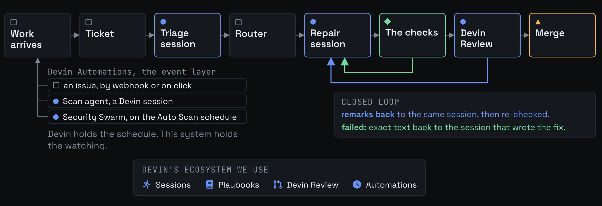

# swe-loop

[](https://github.com/charliebachg/swe-loop/actions/workflows/ci.yml)

**Tickets in, verified pull requests out.** A loop on the Devin API for the work dependency bots
can open but cannot finish: major-version upgrades. Devin scopes each ticket and writes the fix.
Code decides what happens next: it routes the ticket, checks the fix from a clean checkout, asks
Devin to review it, and reports. A person merges. Nothing reaches the base branch on the AI's
word alone.

The app calls itself Backstop, because that is its job: it stands behind the AI and catches what
should not go through. It is demonstrated on `apache/superset`'s pandas 2.3.3 to 3.0.5 bump
([apache/superset#42671](https://github.com/apache/superset/pull/42671)), a three-line dependency
pull request open for a month with the test suite red, because the migration behind it had never
been scoped.

## TL;DR

Work arrives three ways, each event-driven: an issue on the repository, a scan agent pointed at
the code, or Devin's security scanner on a schedule. Each becomes a ticket, and the loop takes it
to a verified pull request with a person only at the merge. There are two ways to run it.

### 1. Simulate, no keys

```
docker compose up
# open http://localhost:8000
```

Plays back a recorded live run: every ticket, session, check log, review and merge, on every page.
Nothing reaches the network, and anything the replay has to make up says so on it. Each ticket
links to the real issue and pull request on the fork, so any claim on screen is verifiable on
GitHub. This is the fastest way to see the whole system.

Or without Docker: `uv venv && uv pip install -e ".[dev]"`, then `python -m swe_loop seed` and
`python -m swe_loop serve`.

### 2. Run it live, with your Devin key and a fork you own

```
cp .env.example .env     # add DEVIN_API_KEY and DEVIN_ORG_ID, set SWE_LOOP_MODE=live
docker compose up
```

Live mode needs a repository your Devin can push to, which for a repository you do not own means a
fork. In short: fork `apache/superset` (or copy it into an empty repository), install the Devin
GitHub App on your fork, point `configs/superset-pandas3.yaml` at it, then file a labelled issue or
run the scan agent. The full steps, and what a GitHub token and a local test clone add, are in
[Running it live](#running-it-live).

## What it did

Every row comes out of the store, printed by `python -m swe_loop receipts`, so this table and the
app cannot drift apart.

| ticket | issue | scope | went to | checks | Devin Review | where it is |
|---|---|---|---|---|---|---|
| #00001 | [#1](https://github.com/charliebachg/superset/issues/1) | `client_processing.py` | Devin | passed | 1 comment | waiting for a person, [#13](https://github.com/charliebachg/superset/pull/13) |
| #00002 | [#2](https://github.com/charliebachg/superset/issues/2) | `pivot.py` and 2 more | Devin | passed | 4 comments | merged, [#8](https://github.com/charliebachg/superset/pull/8) |
| #00003 | [#3](https://github.com/charliebachg/superset/issues/3) | `aggregate.py` and 2 more | Devin | passed | 3 comments | merged, [#9](https://github.com/charliebachg/superset/pull/9) |
| #00004 | [#5](https://github.com/charliebachg/superset/issues/5) | not scoped | a person | not run | not requested | with the team |
| #00009 | filed by a scan | `core.py` | Devin | passed | 0 comments | merged, [#14](https://github.com/charliebachg/superset/pull/14) |
| #00010 | filed by a scan | `result_set.py` | Devin | passed | no issues | merged, [#15](https://github.com/charliebachg/superset/pull/15) |
| #00011 | filed by a scan | `dataframe_utils.py` | Devin | passed | no issues | merged, [#16](https://github.com/charliebachg/superset/pull/16) |
| #00012 | filed by a scan | `api.py` | a person | passed | 0 comments | merged, [#17](https://github.com/charliebachg/superset/pull/17) |
| #00016 | filed by a scan | `csv.py` | Devin | passed | 1 comment | merged, [#19](https://github.com/charliebachg/superset/pull/19) |
| #00019 | filed by a scan | `compare.py` | Devin | passed | no issues | merged, [#22](https://github.com/charliebachg/superset/pull/22) |

Nineteen tickets from three ways in: four from the fork's issues, ten from a session pointed at the
repository, five from Devin's scanner. Twelve changes were written and checked; twelve passed; 11
were merged by a person, 1 waits on one, and 3 tickets were refused before anything was spent on
them. Cost: $62.75 across 29 sessions and 160 minutes of active AI work.

Where the loop is honest rather than lucky: **#00001** hit tests it may not edit, so it asked, a
maintainer answered on the issue, and it re-scoped from that answer. **#00004** it refused, because
whether fifteen failing tests or the code is wrong is a product decision. **#00019** it could not
verify, because a broken acceptance command meant nothing ran, and it recorded that as unverified
rather than a pass. **#00012**, a security finding, went to a person, because this repository
requires such a finding to name the `SECURITY.md` row it violates and be filed as a question when
it cannot.

Measured: 25 unit tests failed on pandas 3.0.5 before any of this; with the merged changes, 11
pass, and the 14 that still fail are all in the test file the system refused to touch.

## Why an agent

Detection was never the missing piece: three tools were already running on
`apache/superset#42671` and none moved it. Dependabot opened the pull request and stopped, because
its job ends where code changes begin. The gap is doing the work and being able to trust what comes
back, and that cannot be scripted. pandas ships no migration tool; its own guidance is a loop, fix
what the warnings fire and run it again. The work order even carried pandas' own prescribed remedy,
quoted from the warning text, and the acceptance command rejected it: the rule is right in general
and wrong in this file, so the session had to iterate to a fix clean on both versions
([#13](https://github.com/charliebachg/superset/pull/13)). No static analysis finds that.

Most of this repository is deliberately not an agent. The detector, the router, the gate and every
number on the Report are code; the agent is only the part that reads a failing test and decides
what to do, and everything around it exists to check that decision.

## What this uses of Devin

Devin is the worker at every step that needs judgement, and the primitives are used as they ship:

| | |
|---|---|
| **Sessions** (v3) | scoping, repair, and the scan, each with a playbook, a structured output contract and `max_acu_limit` |
| **Playbooks** | the instructions per kind of session, editable on the Playbooks page |
| **Knowledge notes** | repo-pinned, trigger-retrieved, created on the organisation by `apply-config` |
| **Structured output** | a draft-07 schema per session kind. A terminal session with no structured output is a failure, not a pass |
| **Devin Review** | requested on work the checks passed; its remarks are posted back into the session that wrote the code |
| **Code scans** | Devin ships a scanner, so this runs it rather than describing one. A scan is started with an *area* to look in, never a defect to look for |
| **Remediation** | `findings/{id}/remediate`: Devin fixes its own finding and opens the pull request |
| **Auto-scan schedules** | the recurrence is Devin's, registered against the scan and backed by an Automation. This app keeps no timer of its own; Devin has no outbound webhook, so the app polls and records what the schedule did |
| **Session Insights** | used in full: the classification and message counts that arrive with every session, plus Devin's analysis generated per session, its detected issues by impact, action items by kind (knowledge, prompt, repo config, machine setup), timeline, note usage and a suggested prompt, gathered on the Insights page as the change list for the next run |

## How it works



Blue is a Devin session, green is code, amber is a person. The event layer on the left is the three
ways in; the closed loop on the right is the gate feeding failures and review remarks back to the
session that wrote the fix.

The gate never trusts a session's own report. It checks out the pull request head into a detached
worktree, diffs it for the paths a session may not touch (`tests/`, `.github/`, migrations,
dependency files), and runs the acceptance commands itself; evidence is bound to the tree hash it
ran on, and a session with no structured output is a failure, not a pass. When a triage session
needs a decision it ends its turn and asks; the answer goes back to it. Devin Review's remarks on a
passed pull request go back to the repair session, and the revised head is gated again before
anyone sees it.

## Running it live

Devin reads any public repository, but it pushes only where its GitHub App is installed, and that
installation belongs to one Devin organisation. So a live run needs a fork you own. Three
attachments, all on your side:

1. **Your fork to your Devin.** Fork `apache/superset` into your account (GitHub offers no Fork on
   a repository you already own, so in that case create an empty repository and push the code into
   it). Install the Devin GitHub App on it, in Devin's settings under Integrations, GitHub, keeping
   "Only select repositories". This is a different attachment from a GitHub token's repository list,
   and it is the one that lets a session push.
2. **Your Devin to this app.** In your Devin organisation, Settings, Service users: create one and
   copy its `cog_` key and the organisation id into `.env` as `DEVIN_API_KEY` and `DEVIN_ORG_ID`,
   with `SWE_LOOP_MODE=live`. Optionally a fine-grained `GITHUB_TOKEN` scoped to your fork.
3. **Your fork to this app.** In `configs/superset-pandas3.yaml`, set `repo:` to your fork. The
   first live run puts this project's playbooks and Knowledge notes on your organisation by itself.

Then give it work. Forks carry no issues, so either file one on your fork with the `swe-loop` label
(create the label first; it does not travel with a fork), or click Run on the scan agent, which
finds work itself. An issue without the label is invisible to the loop on purpose. Run on "Issues
from repo" scopes it, fixes it, checks it, has Devin Review read it, and the pull request opens on
your fork. The merge is yours to click.

| with | you get |
| --- | --- |
| no keys | replay: every page, the recorded run, nothing on the network |
| `DEVIN_API_KEY` and a fork | live sessions: tickets scoped and repaired, Devin opens pull requests on your fork, the reviewer reads them back. Intake reads a public repository without a token |
| `GITHUB_TOKEN` as well | merging from the dashboard, marking a pull request draft while the reviewer reads it, the "What changed" diff view |
| a local clone with two environments | the independent checks: acceptance commands re-run on a clean copy the session cannot write to |

**The checks** re-run each ticket's acceptance commands on a clean checkout, through interpreters
this app controls. That needs a local clone of your fork at `gate.repo_root` (`../superset-fork` by
default) carrying `.venv-p2` (pandas 2.3.3) and `.venv-p3` (pandas 3.0.5), built as
`knowledge/superset-pandas-test-environments.md` describes: about twenty minutes. Without it a live
run still scopes and fixes; the pull request then reaches a person with "the checks could not run
here" on the ticket, never an implied pass. In Docker, point `SWE_LOOP_FORK` at that clone, and
read the store from inside the container (`docker exec ... python -c ...`), not with a host
`sqlite3` on the bind-mounted file while the container runs.

With a key and no fork, "Scope only" on any automation runs the loop up to the point where writing
would begin: real sessions scope every ticket and the router decides, nothing is pushed. The
command line does the same as the pages; run `python -m swe_loop --help` for the verbs.

## The app

One process, one SQLite file, a sidebar. Each step says who does it, the AI or a person, and every
session is priced.

| page | shows |
|---|---|
| **Home** | the last run in five steps, what needs a person now with the buttons to act, what is running, and what just happened |
| **Automations** | the three ways work enters and what each does, with a run history. Add your own |
| **Tickets** | every ticket by number, grouped by source, with a one-line account and a four-step pipeline: scoped, fixed, verified, merged |
| **Report** | three rates over stated denominators (verification pass, human intervention, acceptance), lightweight numbers to watch, every check with its log, and the whole event log |
| **Sessions** | every session: the ticket, cost, whether the checks passed, when it ran. Click for its timeline and evidence |
| **Playbooks / Knowledge** | the instructions each session follows and the notes it is given about the repository |
| **Insights** | the sessions as Devin records them, and its own analysis of what to change. Nothing here is our measurement |
| **Settings** | the connected repository, what a session may never touch, the budget caps, and live connection checks |

The Report answers the question an engineering leader asks: *how would I know this is working?*
Every number is a count with its denominator, never a percentage on its own; the run is small and
the page says so. It also states plainly what it cannot tell you. The person who merges is recorded
as a hash, never a named engineer.

## Cost, security, and layout

**Cost on a self-serve plan.** Self-serve Devin plans are billed in dollar credits and the API
reports `acus_consumed` as 0.0, so the loop measures cost itself: active minutes from its own polls
times a rate per session kind, refined by the console's per-session figures entered on Settings.
That makes the figure a floor rather than a total, and the Report says so. On an ACU-metered plan
the same pages show ACU.

**What it runs, and where.** The acceptance commands come from a scoping session's structured
output, which is a model's writing, and the loop runs them: treat this like a build script from a
pull request. Point it at a repository you trust and run it in the container. The commands run in a
detached worktree the session cannot reach, which stops a session marking its own homework; it does
not sandbox the command itself. The dashboard has no sign-in and merges with whatever token is
loaded, so `compose.yaml` publishes it on loopback only.

**The seam.** Everything specific to a target lives in `configs/superset-pandas3.yaml`: the
repository, the trigger, the acceptance commands, the router policy, and the session caps.
`configs/example-minimal.yaml` is a second seam the router tests run against, to keep the code
target-agnostic.

**Layout.**

```
swe_loop/          one module per step: intake, triage, router, shard, dispatch, poll, gate, followup, reduce, report
  devin.py         the v3 client behind a transport; the fake transport replays fixtures
  store.py         the ticket store: SQLite, WAL, the headline queries
  detect/          the pandas warning detector that built the inventory
configs/           the seams
playbooks/         the triage, repair and scan playbooks
schemas/           structured output contracts (draft-07, self-contained)
knowledge/         repo-pinned Knowledge notes
data/replay/       the recorded run, redacted
templates/ static/ the app, served with no internet needed
tests/             220 tests; the checks are tested against a real git fixture
```

## Development

```
uv pip install -e ".[dev]"
pytest -q
ruff check . && ruff format --check .
```

Built with coding assist tools, with Fable.
